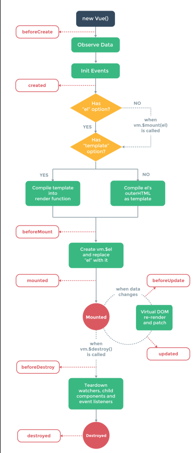
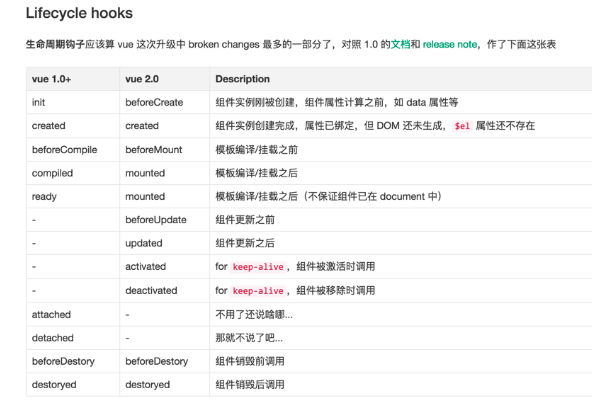

# 学习VUE文档
http://cn.vuejs.org/v2/guide
http://cn.vuejs.org/v2/api

## GUIDE
我们要做的不仅仅是是一个hello world。

### 几个重点
1. 子元素通过 props 接口实现了与父亲元素很好的解耦
2. 单向数据流，父组件改变会通知子组件，但是子组件改变不会影响父组件
   > 注意在 JavaScript 中对象和数组是引用类型，指向同一个内存空间，如果 prop 是一个对象或数组，在子组件内部改变它会影响父组件的状态。
3. 父组件通过 props 向下传递数据给子组件，子组件通过 events 给父组件发送消息
4. HTML 特性不区分大小写。当使用非字符串模版时，prop 的名字形式会从 camelCase 转为 kebab-case（短横线隔开）
5. 初学者常犯的一个错误是使用字面量语法传递数值(错:<comp some-prop="1"></comp>)(对:<comp v-bind:some-prop="1"></comp>)
6. 如果把切换出去的组件保留在内存中，可以保留它的状态或避免重新渲染。为此可以添加一个 keep-alive 指令参数

### 事件
Vue 的事件系统分离自浏览器的 EventTarget API。尽管它们的运行类似，
但是 $on 和 $emit 不是addEventListener 和 dispatchEvent 的别名

### 生命周期

### 生命周期钩子

## API

### $refs
获取所有通过ref指定的子组件

### $slots
访问分发内容

### $mount
如果 Vue 实例在实例化时没有收到 el 选项，则它处于“未挂载”状态，没有关联的 DOM 元素。可以使用 vm.$mount() 手动地挂载一个未挂载的实例

## 重要资料集锦
https://github.com/vuejs/awesome-vue
https://github.com/Ma63d/kov-blog
